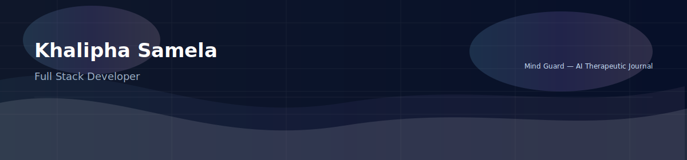

# 👋 Hi — I’m **Khalipha Samela**
I build clean, human-centered digital experiences. 
Web Apps • APIs • Databases • AI-Enhanced Tools

---

## 🎯 Quick Summary
- 🔭 **Current Project:** *Mind Guard* — a therapeutic AI journal app.  
- 🛠️ **Core stack:** HTML • CSS • JavaScript • PHP • MySQL • Java  
- ⚛️ **Learning:** React  
- 📫 **Connect:** [GitHub](https://github.com/Khalipha-Samela) • [LinkedIn](https://www.linkedin.com/in/khalipha-samela)

---

## 🧩 What I build
I focus on polished, usable apps:
- Thoughtful UI/UX with accessible design patterns  
- Reliable server-side logic and clean database schemas  
- Small, elegant experiments combining AI and human-centered flows

---

## 🛠 Tech Stack

---

## 🚀 Featured Project — Mind Guard
**Mind Guard** — A therapeutic AI journal app that helps users reflect and receive gentle, evidence-informed prompts and insights.

**Stack:** HTML • CSS • JS • PHP • MySQL • AI API  
**Repo:** *(add link to your project repo here)*

---

